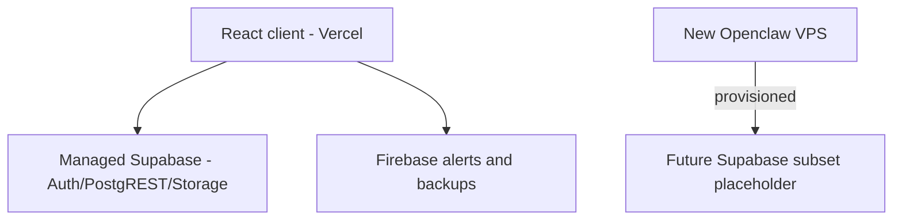
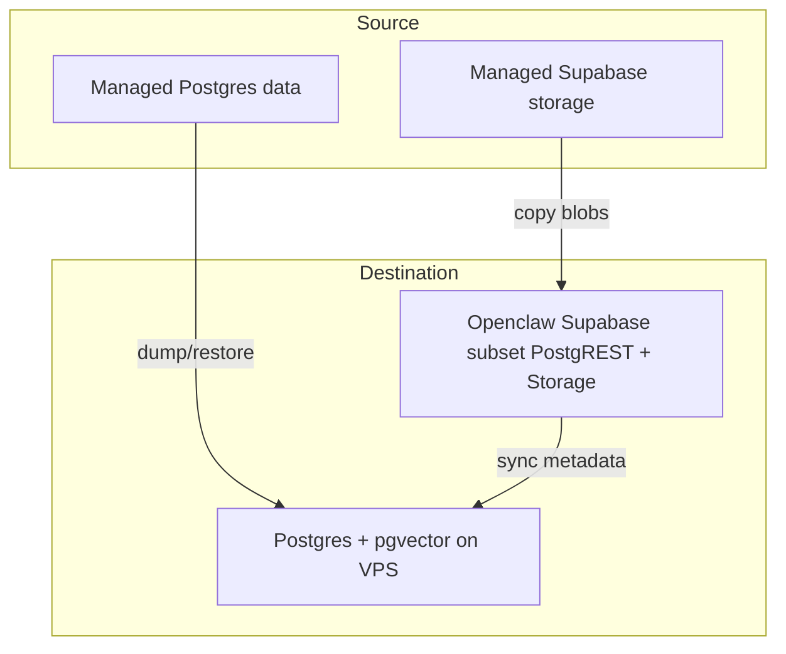
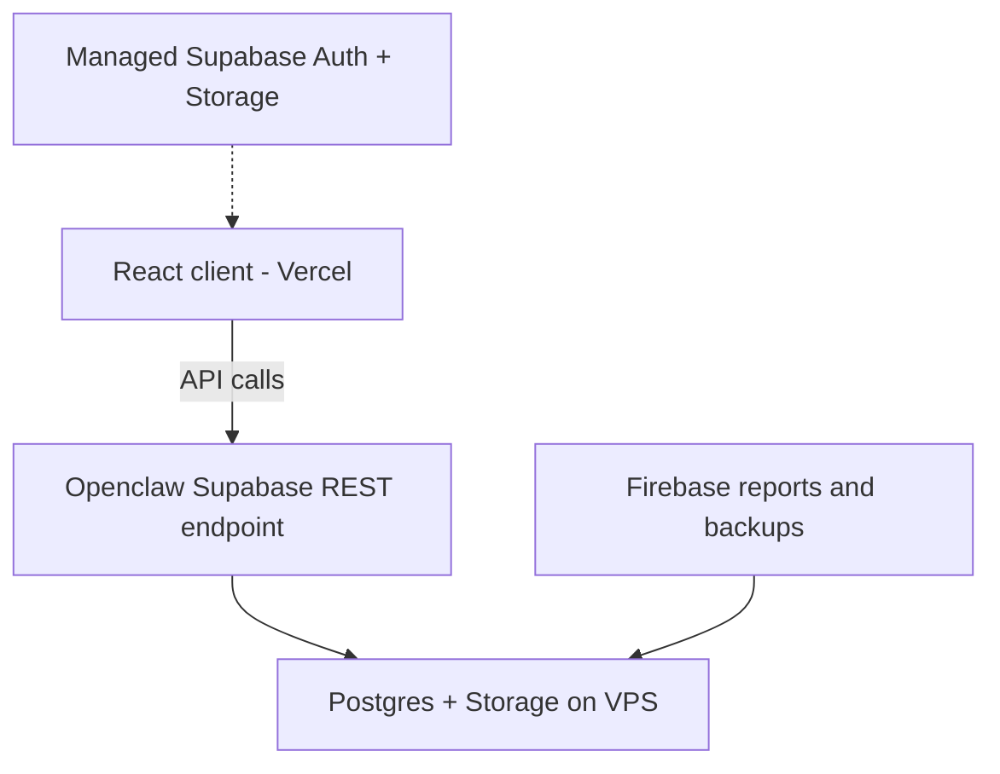

# Linkmemo React & Openclaw Migration Notes

## 1. Current Linkmemo React + Supabase stack
- The browser/client is Vite + React talking to Supabase SDK via `createClient` with `VITE_SUPABASE_URL` and `VITE_SUPABASE_ANON_KEY`.
- Supabase Auth currently relies on Google OAuth (`signInWithOAuth`).
- CRUD for the `notes` table happens through PostgREST (`from('notes')`), while storage blobs are served via Supabase Storage.
- Row-level security uses `user_id` and the built-in JWT claims so that each signed-in user can only see their own notes.

## 2. Openclaw-based deployment options
- **Option A (self-hosted Supabase on Openclaw)**: Deploy Supabase services (Postgres, Auth/Gotrue, PostgREST, Storage, Realtime, Kong, etc.) inside the Openclaw VPS with Docker Compose, TLS (Caddy or Nginx), monitoring (vector/loki/prometheus/grafana), and backups (pg_dump + WAL shipping).
- **Option B (standalone API + managed Supabase)**: Keep Supabase hosting managed and just expose the API endpoints while Openclaw passes requests to the hosted stack. This reduces operational work but still requires aligning domains and credentials.

## 3. Migration phases
1. **Phase 0: Openclaw infra prep**
   - Provision a VM with Docker Compose, firewall rules, TLS certificates (Let's Encrypt), and storage for backups/logs.
   - Point `app.yourdomain.com` and `api.yourdomain.com` to the new Openclaw stack.
2. **Phase 1: Supabase subset on Openclaw**
   - Deploy Supabase components that support current features.
   - Populate `.env` with DB URL, JWT secret, anon/service keys, and SMTP setup.
   - Rebuild the `notes` data model, RLS policies, and migrations.
   - Sync existing `notes` data and storage blobs from the managed Supabase account.
3. **Phase 2: Auth handling (managed Google)**
   - Keep Google OAuth on the existing cloud console (no migration today) while giving the React frontend transparent redirects to Openclaw endpoints.
   - Update the React app’s login/logout flows to point to the new API domain while reusing the same credential flow.
4. **Phase 3: Controlled rollout**
   - Smoke test the Openclaw Postgres instance for data integrity (user IDs, `created_at` / `updated_at`).
   - Ensure JWT claims and RLS rules lock data access.
5. **Phase 4: Release coordination**
   - Update Vercel/staging build vars to the Openclaw Supabase URL and anon key.
   - Align extension/update release notes with the new API domain.
   - Desktop/Tauri and extension redistribution remain out of this release (see scope note).
6. **Phase 5: Hardening and DR**
   - Monitor auth/rest/db traffic, secure SSH (fail2ban), and document backup/DR playbooks.
   - Establish RPO/RTO requirements and Supabase/Postgres runbooks.

## Additional migration constraints
- Google OAuth does not need to be migrated to the self-hosted stack; keep the existing Google sign-in surface as-is and plan for gradual integration later if necessary.
- Implement only the minimum Postgres features required to support the Supabase capabilities currently in use (notes CRUD via PostgREST, `user_id`-based RLS, storage blobs, and any related JWT claims).

## Database architecture evaluation
- **Relational baseline**: The `notes` table (id, `user_id`, `title`, `content`, `tags`, `focus`, timestamps) sits well inside Postgres because it needs consistency, transactional updates, JSON-friendly columns, and Supabase’s RLS hooks. PostgREST plus JWT-driven RLS remain the simplest way to secure per-user access and match the existing React client.
- **NoSQL alternatives**: Document stores like Firestore or MongoDB offer schema flexibility but would require re-implementing RBAC and could break SQL constraints (e.g., unique slugs). Consider a NoSQL prototype only if the workload’s shape changes (massive ingest or entirely unstructured data).
- **Vector/embedding stores**: If future features need semantic search, keep the canonical note metadata in Postgres and mirror embeddings into a vector-capable extension (pgvector) or a dedicated service (Pinecone, Milvus, etc.) referenced by note ID.
- **Hybrid mixes**: Keep Supabase Storage for blobs and Postgres for structured metadata. Add supplementary caches or key-value stores (Redis) only when latency-sensitive use cases demand more elasticity.

## Desktop and extension scope
- Rust/Tauri desktop clients keep targeting the current Supabase endpoints; their Supabase URL/auth endpoint updates are out of this migration scope. Update them in a follow-up release when the desktop redistribution plan is ready.
- Browser extension updates stay on the current Vercel host until the new APIs are validated.

## Operational considerations
- Maintain consistent dev/stg/prod envs with the same OAuth callback URLs.
- Document the Openclaw API/auth endpoints so QA, Web, and Desktop teams know which URLs to plug into.
- Use feature flags around the new endpoints to control cutovers and rollback if needed.

## Migration diagrams
Below are three Mermaid diagrams, one for each migration step. Each diagram is self-contained so you can see the relevant systems at that phase.

### Phase 1 – Starting point

### Phase 2 – Storage migration

### Phase 3 – Cutover

