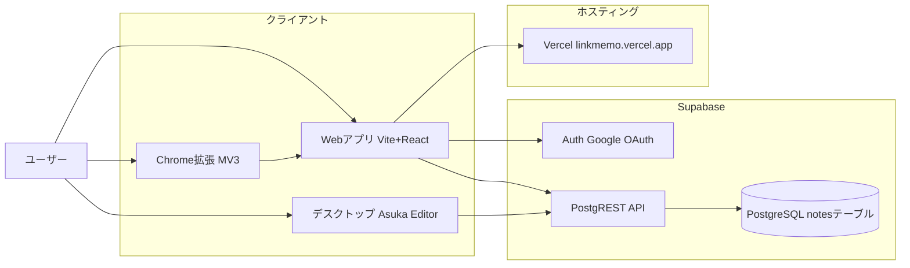
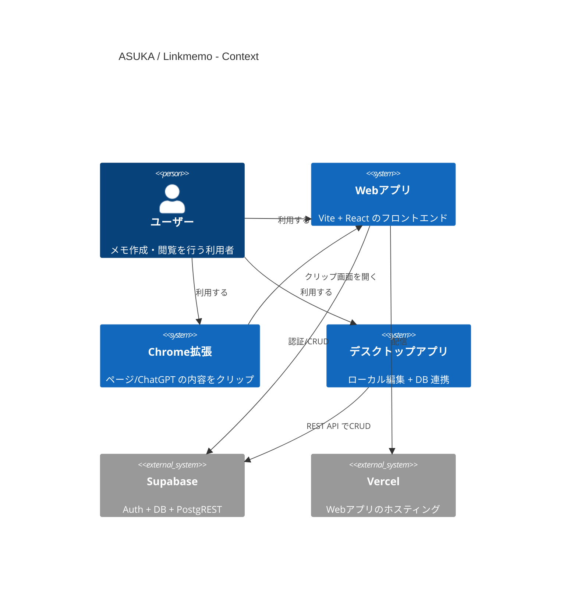

# System Overview (ASUKA / Linkmemo)

## 概要
ASUKA / Linkmemo は、Vite + React の Web アプリを中心に、Supabase をバックエンド（認証とデータベース）として利用するメモ管理システムです。補助的に Chrome 拡張（クリップ機能）と Tauri デスクトップエディタがあり、どちらも同じ Supabase データベースに接続します。

## コンポーネント
- **Web アプリ（`src/`）**: React 画面、ノート一覧/編集/クリップ取り込みを提供。  
- **Supabase**:  
  - **Auth**: Google OAuth によるログイン。  
  - **PostgREST / DB**: `notes` テーブルへの CRUD。  
- **Chrome 拡張（`extension/`）**: Web ページや ChatGPT 応答を抽出し、`/clip` へ渡す。  
- **デスクトップアプリ（`apps/asuka_editor/`）**: ローカル編集 + Supabase への直接保存。  
- **ホスティング（Vercel）**: Web アプリ配信先（`https://linkmemo.vercel.app` が既定）。  

## 接続関係（Mermaid）

## 主なフロー（要約）
1. **認証**: Web アプリは Supabase Auth（Google OAuth）でログイン。  
2. **ノート CRUD**: Web アプリは Supabase JS SDK で `notes` を操作。  
3. **クリップ**: Chrome 拡張が `https://linkmemo.vercel.app/clip` を開き、URL/コンテンツを渡す。  
   - 長文は `chrome.storage` に保持し、Web アプリが拡張へ問い合わせて取得。  
4. **デスクトップ編集**: Tauri アプリは Supabase REST API に直接アクセスして保存/取得。  
5. **移行**: Firebase データはスクリプトで Supabase へ一括移行（運用外の補助作業）。

## C4 ダイアグラム（Mermaid）

